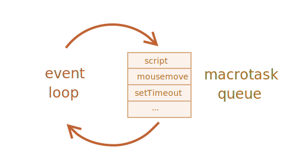
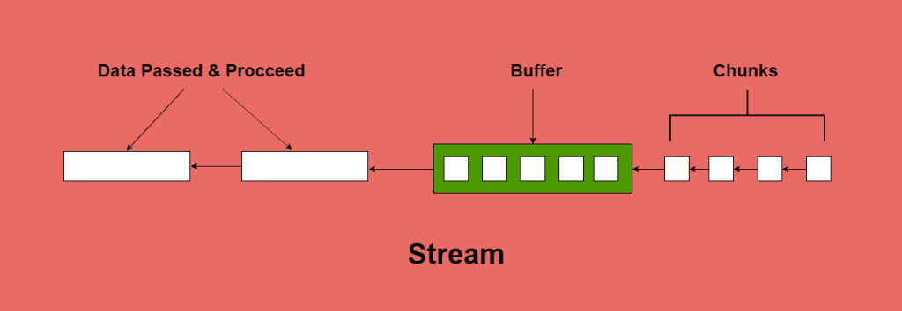

# Javascript는 생산성이 높다

---

## Javascript의 장점

- **비동기 I/O 사용**
- 쉬운 언어
- back-end, front-end 모두 사용 가능
- 멀티 플렛폼 지원
- ...

---

## 멀티쓰레드의 필요성

- I/O를 사용하는 과정에는 CPU가 일을 하지 않는다
- DB에서 대량의 데이터를 추출하는 경우 싱글 쓰레드로는 속도가 느리다

```js
function getResource() {

  // 조회 전 로직

  const result = fetch('http://localhost:3000') // 작업 완료까지 대기 

  // 조회 후 로직
}
```

---

## 멀티쓰레드의 장점

병렬 처리 능력

- 여러 작업을 동시에 처리할 수 있어 성능 향상
- CPU 자원을 효율적으로 활용
- 응답성 향상으로 사용자 경험 개선

---

## 멀티쓰레드의 문제점

- 메모리에 동시 접근
- 예상할 수 없는 오동작
- 재현 불가능으로 디버깅 불가능

---

## 멀티쓰레드 동기화

- synchronized: 구역 동기화
- Lock: 더 작은 단위 동기화
- Atomic: 단일 변수의 원자적 연산
- volatile: 가시성만 보장하면 될 때
- Concurrent 컬렉션: 여러 스레드가 컬렉션에 접근할 때
- Semaphore: 리소스 풀 관리에 적합
- CountDownLatch: 일회성 동기화 지점이 필요할 때
- CyclicBarrier: 반복적인 동기화 지점이 필요할 때
- Exchanger: 스레드 간 데이터 교환이 필요할 때
- Phaser: 단계별 동기화가 필요할 때

---

## 멀티쓰레드 동기화 문제점

- 복잡하다
- Dead Lock 발생
- 과한 동기화로 성능 저하
- 코드가 쓰레드 세이프한지에 구분이 모호
- 쓰레드의 책임이 어디에 두는지 모호 (호출하는 쪽인지 당하는 쪽인지)

---

## Lock Free 

- Lock 메커니즘을 사용하지 않고 원자적 연산(atomic)을 통해 동시성을 제어하는 방식
- 락을 사용하지 않으므로 데드락 발생 불가능
- 여러 쓰레드가 대기 없이 동시 접근 가능
- 락 획득/해제 오버헤드 제거
- 문맥 교환(Context Switching), 쓰레드 감소 

---

## Lock Free 문제점

- 더 복잡하다
- 기존 멀티쓰레드와 혼재되면 모든 단점이 섞인다

---

## Lock Free 개념
1. 코드 상에서 blocking이 발생하는 지점을 기준으로 2개의 구역으로 나눈다
1. 구역을 하나의 메시지와 같이 만들어서 Queue에 넣는다
1. block된 곳에서 응답이 오면 이후 코드를 Queue에 넣어 후속 처리를 한다

```js
function getResource() {

  // 코드 1
  const url = useData('url')

  // 코드 2 
  const result = fetch(url) 

  // 코드 3
  return result
}
```

---

## Nodejs
- 코드를 작은 Task로 만들어서 Queue에 넣는다


---

## Nodejs의 비동기 처리
```js
async function getResource() {

  // 코드 1
  const url = await useData('url')

  // 코드 2 
  const result = await fetch(url) 

  // 코드 3
  return result
}
```

---

## front-end 비동기 처리
```vue
<script setup>
const { data } = useQuery()
</script>

<template>
  <div>{{ data }}</div>
</template>
```

---

## Nodejs로 대용량 처리
- Stream 방식으로 처리
- 데이터를 작은 chunk로 나누어서 처리
- 비동기 I/O를 극대화


---

## Stream 효율화 문제
- 저속 평준화
- 매 버퍼간에 복사되는 문제
- 버퍼의 크기

---

## Nodejs는 생산성이 높다
- 비동기 I/O 코딩을 손쉽게 사용할 수 있다
- 비동기 I/O는 다른 언어에서도 사용이 가능하지만 간단하지 않다
